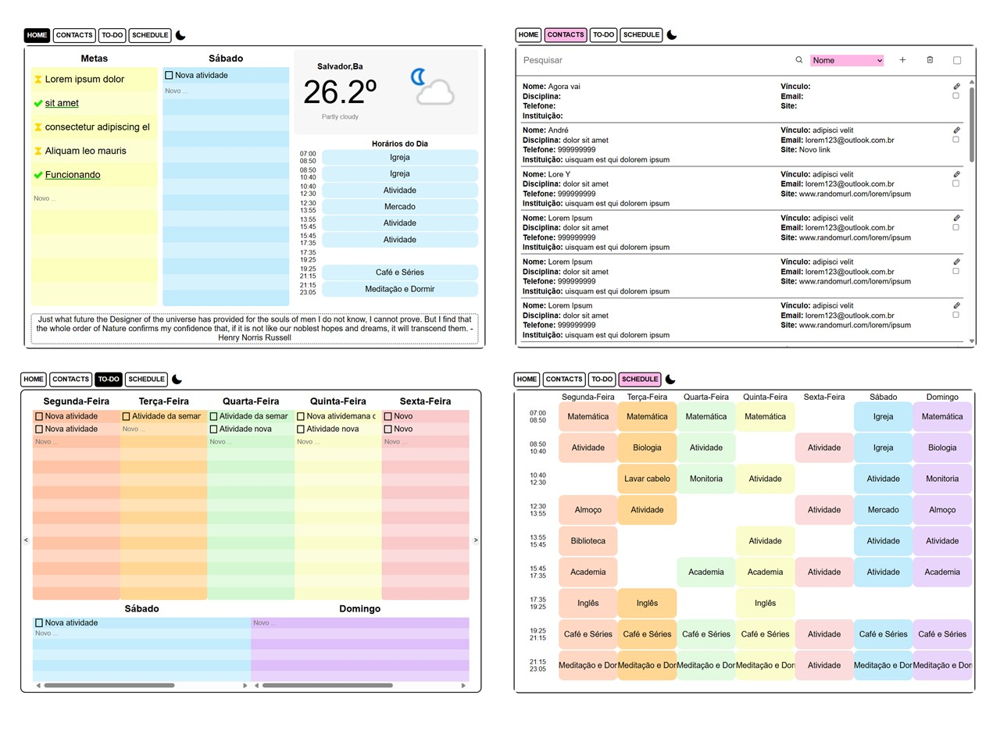

# Planner Digital

## Overview
O Planner Digital reúne todos os principais recursos de organização e planejamento que podem ser encontrados numa agenda ou planner físico.
 
Na aba de Contatos é possível acessar com facilidade as informações mais relevantes dos seus contatos importantes. Na aba To Do é possível programar as tarefas diárias para a semana atual e para semanas seguintes. E no Schedule é possível organizar os horários da semana. 
Na Home ficam expostos a lista de tarefas do dia, os horários do dia, a previsão do tempo na sua cidade, e uma lista de metas a longo prazo. 

O propósito é proporcionar um recurso que pode ser acessado de qualquer lugar e não tem as limitações de objetos físicos. Se o seu planner é digital, não há o risco de esquecê-lo em casa e ficar perdido durante o dia.

### Screenshot

### Instalação e Execução

1.	Necessidades do Ambiente: Mysql, NodeJS, Navegador Web(de preferência Edge, Chrome ou Firefox), IDE e acesso à internet. 
    1.	Clone o repositório, acesse a pasta “mysql files” e execute o Script SQL no Mysql. 
    2.	Acesse a pasta “api-v2”, preencha o arquivo .env com as informações do banco de dados, abra a pasta “api-v2” no Terminal e execute o index.js com o Node.
    3.	Abra o arquivo AppointmentBook.html no navegador e use livremente. 

### Uso do Projeto:

1.	Inserção: Escreva uma nova tarefa no campo “Nova tarefa” e pressione “Enter”/ Clique na atividade em branco, escreva uma nova atividade e pressione “Enter”.
2.	Edição: Clique duas vezes numa tarefa ou atividade, edite o texto e pressione “Enter”
3.	Deletar: Clique duas vezes na tarefa / atividade, delete todo o texto e pressione “Enter”.
4.	Para mudar de aba: clique no nome da aba para a qual pretende navegar. 
5.	Avançar e Retornar semanas na aba To Do: clique nas setas (“<” e “>”) posicionadas nas laterais da aba.

## Ferramentas / Tecnologias

- HTML5
- CSS3
- Javascript Vanilla
- NodeJs
- Mysql e SQL 
- Windows PowerShell

## Recursos

- [MDN Docs](https://developer.mozilla.org/) 
- [w3 Schools](https://www.w3schools.com/)
- [StackOverflow](hhttps://pt.stackoverflow.com) 
- [Colorhunt - Paletas de Cores](colorhunt.co)
- [Phospor - Biblioteca de Ícones](https://phosphoricons.com/)
- [API do Clima](https://www.weatherapi.com/)
- [API de Citações](https://api-ninjas.com/api/quotes)

## Autora

- Github - [@luanasj](https://github.com/luanasj)
- Linkedin - [@lsjesus](https://www.linkedin.com/in/lsjesus/)

